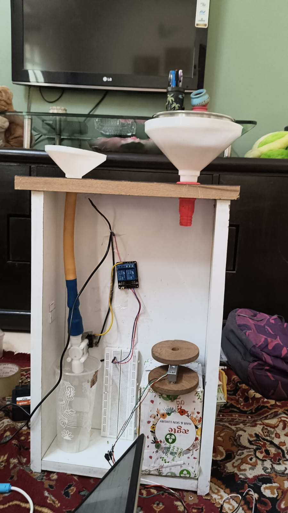

<h1>💡 Smart Ration Distribution System</h1>

  The <strong>Smart Ration Distribution System (SRDS)</strong> modernizes the <strong>Public Distribution System (PDS)</strong> by using <strong>RFID authentication</strong> to ensure that only eligible beneficiaries receive their rations. By automating the process, it reduces <strong>fraud</strong>, <strong>manual errors</strong>, and <strong>delays</strong>, offering a more <strong>efficient</strong> and <strong>transparent</strong> distribution system. The system provides <strong>real-time access</strong> to accurate records through a web portal, ensuring fair and timely ration distribution.

<h2>🚀 Features</h2>
<ul>
  <li> <strong>RFID-Based Access Control</strong> – Ensures only authorized users can receive rations</li>
  <li> <strong>Real-Time Data Access</strong> – Web portal for real-time record tracking</li>
  <li> <strong>Automated Workflow</strong> – Reduces human intervention in ration dispensing</li>
  <li> <strong>Fraud Reduction</strong> – Minimizes risk by automating ration distribution</li>
  <li> <strong>Efficient Rationing</strong> – Ensures timely and accurate distribution of food items</li>
</ul>

<h2>🛠️ Hardware Used</h2>
<ul>
  <li>Arduino UNO / Raspberry Pi</li>
  <li>MFRC522 RFID Module</li>
  <li>HX711 Load Cell Amplifier</li>
  <li>Load Cell (5kg)</li>
  <li>Relay Module / Solenoid Valve</li>
  <li>DC Motors for dispensing mechanism</li>
  <li>Power Supply & Breadboard</li>
</ul>

<h2>💻 Software Requirements</h2>
<ul>
  <li>Arduino IDE</li>
  <li>HX711 & MFRC522 Libraries</li>
  <li>EEPROM Library (built-in)</li>
  <li>Node.js (for web-based access)</li>
  <li>Serial Monitor for real-time debugging</li>
</ul>

<h2>📸 Preview</h2>

  

